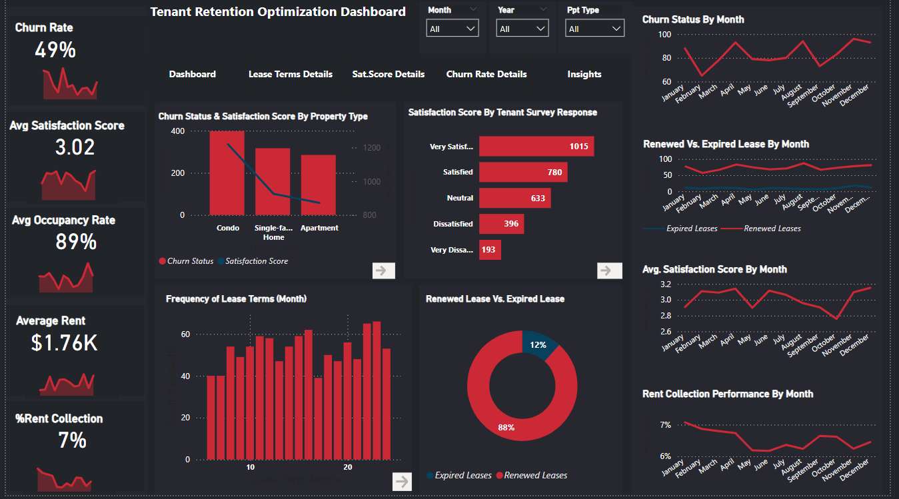
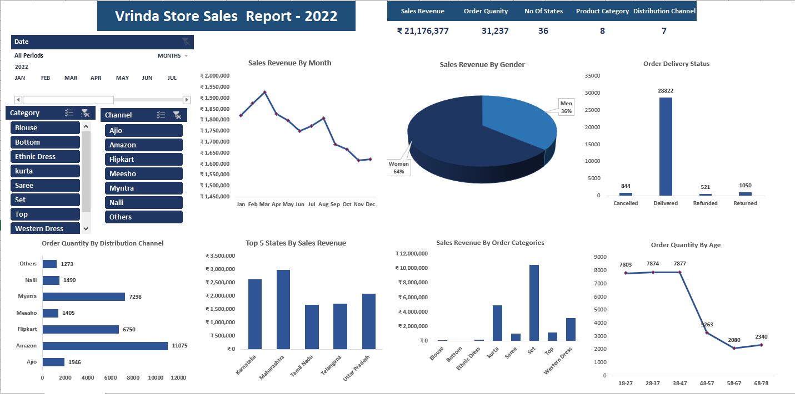
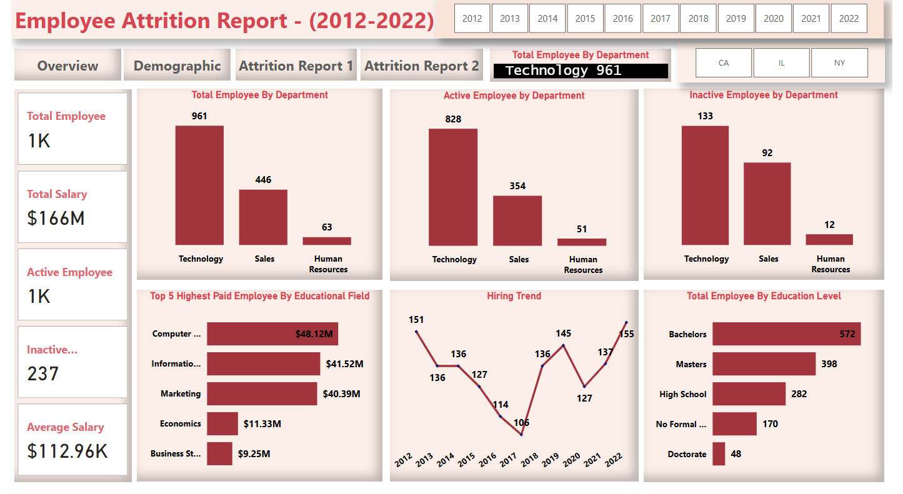
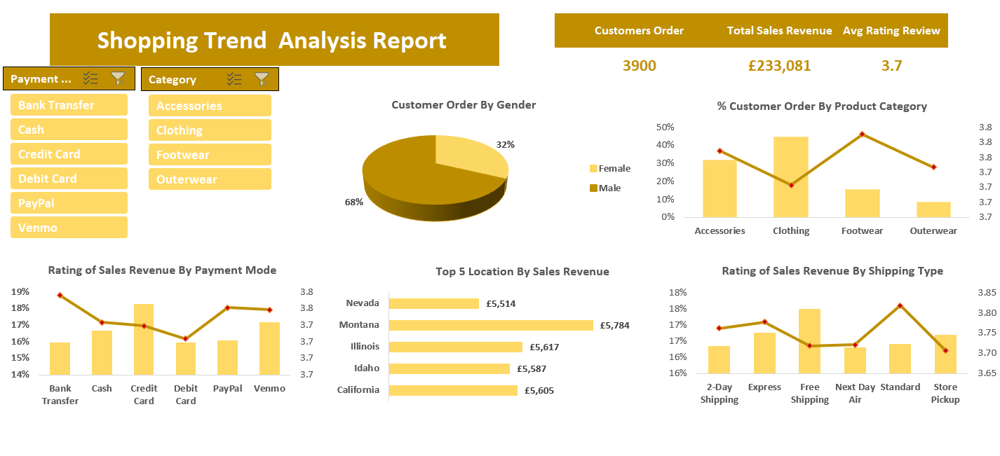
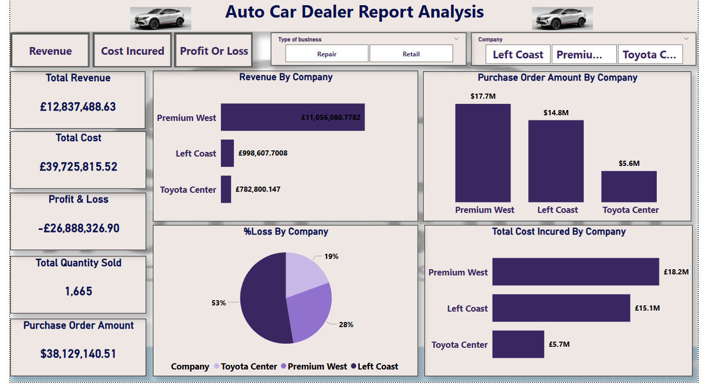
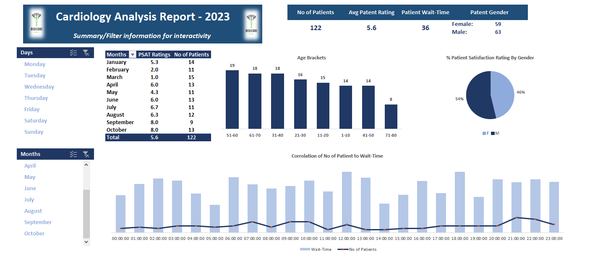
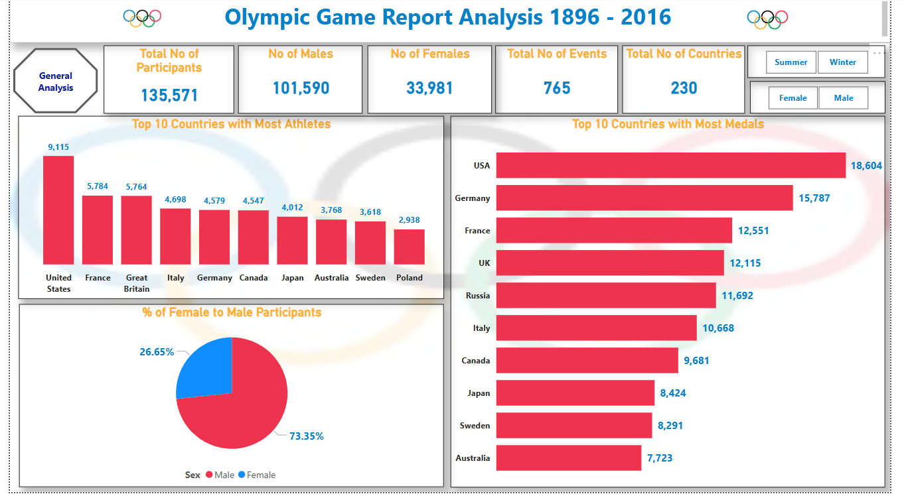
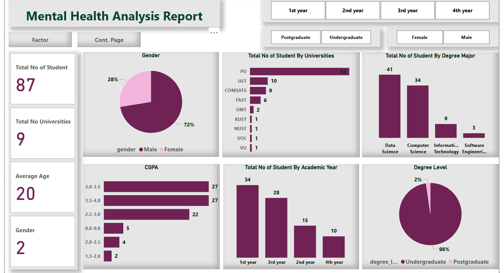

# Project 1 

**Title:** [Tenant Retention Optimization Report](https://github.com/Aviele75/Aviele75.github.io/blob/main/CAR%20DEALER%20REPORT%20ANALYSIS.pbix)													

**Tools Used:** PowerBI, Data Transformation and Cleaning using Power Query Editor, Data Modelling, DAX writing, Dashboard Building and Visualization using charts, slicers, drill through and page navigation.

**Project Description:** 
The project focused on analysing residential real estate data over five years (2020–2025) to uncover trends and patterns related to tenant retention and operational optimization. The objective was to deliver a robust and interactive dashboard that provides a holistic view of key performance indicators (KPIs) relevant to tenant behaviour, lease performance, and financial efficiency across various properties.
The dashboard is designed to empower stakeholders with data-driven insights, allowing them to monitor, evaluate, and make informed decisions around tenant satisfaction, rent collection, and lease management. By consolidating complex datasets into a user-friendly interface, the tool enables a deep dive into the factors that influence tenant retention and property performance.

**Key Performance Indicators (KPIs):**

The dashboard tracks and visualizes the following core metrics:
**Tenant Churn Rate**
**Average Tenant Satisfaction Score**
**Average Occupancy Rate**
**Average Monthly Rent**
**Percentage of Rent Collected**

**Highlighted Features:**
**Churn Status and Satisfaction Score by Property Type:**
A breakdown of churn rates and satisfaction scores segmented by property type offers insights into how different property categories impact tenant sentiment and turnover.

**Lease Term Frequency Distribution:**
Visual representation of lease term durations, illustrating the distribution of tenant preferences and potential links to retention patterns.

**Satisfaction Score by Survey Responses:**
Graphical analysis of tenant feedback, highlighting satisfaction levels and key themes from survey responses.

**Renewed vs. Expired Leases**
Comparative visualization showing the proportion of leases renewed against those that expired or were terminated, providing clarity on lease retention effectiveness.

**Temporal Analyses - Monthly breakdowns of:**
Tenant churn status
Renewed versus expired leases
Average satisfaction scores
Rent collection performance

**Interactive Slicers for Dynamic Analysis:**
**Month Selector** – Enables month-by-month performance review.
**Year Selector** – Filters data across specific years for trend analysis.
**Property Type Filter** – Allows stakeholders to drill down into individual property types for focused performance evaluation.

**Key Insights & Findings:**

**Seasonal Churn Patterns:**
The monthly churn rate visualization reveals recurring seasonal trends, with certain periods showing higher tenant turnover. These patterns indicate when targeted retention strategies may be most impactful.

**Lease Term Preferences and Retention:**
Analysis of lease duration preferences shows a correlation between specific term lengths and tenant retention, suggesting the potential value in adjusting lease offerings to better align with tenant behaviour.

**Satisfaction as a Retention Driver:**
A clear relationship exists between satisfaction scores and tenant retention. Properties with higher satisfaction ratings exhibit lower churn, underlining the importance of tenant experience in retention strategies.

**Financial Operations and Efficiency:**
Rent collection data offers insight into the operational and financial health of the properties. Trends in payment consistency and collection efficiency can indicate areas for process improvement or automation.

**Renewal Strategy Effectiveness:**
Comparing renewed and expired leases over time helps gauge the success of implemented retention strategies and identifies periods where adjustments may be needed.

**Recommendations:**

**Implement Targeted Retention Initiatives:**
Use seasonal churn data to launch proactive retention programs during high-risk periods. These could include personalized outreach, loyalty incentives, or community engagement events.

**Align Lease Offerings with Tenant Preferences:**
Where data indicates a preference for certain lease lengths, consider adapting offerings to meet these preferences. Flexibility in lease terms may encourage longer stays and reduce churn.

**Focus on Enhancing Tenant Satisfaction:**
Address areas identified in tenant feedback that influence satisfaction, such as amenities, maintenance responsiveness, and community atmosphere to foster stronger tenant relationships.

**Optimize Rent Collection Processes:**
Improve financial operations by identifying and addressing inefficiencies in rent collection. Implementing digital payment platforms or incentives for timely payments could support better cash flow and tenant compliance.

**Conclusion:**
The developed dashboard serves as a vital strategic tool for the residential real estate management team and stakeholders. By consolidating critical data into an intuitive interface, it enables clear and actionable insights that support evidence-based decision-making. This tool is instrumental in driving tenant retention, operational efficiency, and long-term business growth.

**Dashboard Overview:** 

# Project 1 

**Title:** [Vrinda Store Sales  Report - 2022](https://github.com/Aviele75/Aviele75.github.io/blob/main/03%20-%20Data%20Analyst%20Excel%20Project%20-%20Virinda%20Store.xlsx)							
							
**Tools Used:** Microsoft Excel - Data Cleaning, Data Analysis, Charts, Pivot Table, Slicer,Timeline

**Project Description:** 
This project focused on analyzing the product sales data of Vrinda Store for the year 2022, with the primary objective of uncovering sales trends and performance patterns across multiple dimensions. The analysis was developed into an interactive dashboard that offers stakeholders a detailed, user-friendly view of key business metrics, enabling data-driven decision-making and strategic planning. The dashboard includes the following features:

**•	Key Performance Indicators (KPIs):**

o	Total Sales

o	Total Order Quantity

o	Average Order Quantity per Customer

**•	Top 5 States by Sales Revenue:**
A visual breakdown of the five states generating the highest revenue, highlighting state performance and market strengths.

**•	Monthly Sales Revenue:**
A trend visualization displaying monthly revenue fluctuations, allowing stakeholders to identify peak periods and off-seasons.

**•	Sales Revenue by Gender:**
A demographic analysis revealing the revenue contribution based on gender, aiding in customer segmentation strategies.

**•	Sales by Order Categories:**
A breakdown of total sales revenue according to different product order categories, helping assess category-level performance.

**•	Order Quantity by Age Distribution:**
A demographic chart showing order volumes across various age groups, which supports targeted marketing efforts.

**•	Order Delivery Status:**
A comprehensive overview of the delivery outcomes, including orders that were delivered, cancelled, refunded, or returned.

**•	Order Quantity by Distribution Channel:**
Insights into how different distribution channels contribute to order volume, providing guidance for logistics and fulfillment strategies.

Additionally, the dashboard is equipped with interactive features, including dynamic slicers and a time-based filter that allow users to:

•	Filter data by **Month** to analyze performance over a specific period or compare across multiple months.

•	Drill down into specific **Product Categories** to evaluate category-wise performance.

•	Analyze sales based on **Distribution Channels** used for delivering customer orders.

**Key findings:**

**•	High-Performing States:**
The analysis successfully identified the top-performing states in terms of revenue, as well as those with underwhelming performance, highlighting opportunities for targeted market expansion and resource allocation.

**•	Monthly Sales Patterns:**
Clear trends emerged over the course of the year, revealing fluctuations that aligned with product cycles and seasonal demand. These insights can inform inventory planning and promotional strategies.

**•	Top Products and Distribution Channels:**
The dashboard pinpointed the most profitable products and the most effective distribution channels. This is valuable for optimizing marketing efforts and improving supply chain efficiency.

**•	Sales Volatility:**
Observations of monthly sales fluctuations revealed broader market dynamics and consumer behavior trends, helping management anticipate future demand and adjust business strategies accordingly.

**Conclusion:**

This sales performance dashboard stands as a vital tool for the management team at Vrinda Store. By presenting a clear, interactive, and insightful analysis of sales data across multiple dimensions, it enables leadership to make informed decisions, identify growth opportunities, and fine-tune operational strategies. The project not only enhances visibility into business performance but also supports Vrinda Store’s long-term planning and competitive positioning in the market.

**Dashboard Overview:** 

# Project 2

**Title:** Adventure Works 2024 Project: SQL Data Query and Manipulation

**SQL Code:** [Adventure Works 2024 SQL Code](https://github.com/Aviele75/Aviele75.github.io/blob/main/Adventure_Works.sql)

**SQL Skills Used:** 
Data Retrieval (SELECT): Queried and extracted specific information from the database.
Data Aggregation (SUM, COUNT, AVRAGE): Calculated totals, such as sales and quantities, and counted records to analyze data trends.
Data Filtering and Sorting (WHERE, BETWEEN, IN, AND, GROUPBY, HAVING, ORDERBY): Applied filters to select relevant data, including filtering by ranges and lists.
Data Source Specification (FROM): Specified the tables used as data sources for retrieval
 
**Project Description:**

This project involves the exploration and manipulation of the AdventureWorks 2024 database, a sample enterprise-level SQL Server database that simulates the operational structure of a manufacturing company. The goal is to write optimized and logically structured Transact-SQL (T-SQL) queries to answer business questions, analyze employee and product data, and create meaningful views and data segmentations to support managerial insights.

**Project Objectives:**

Extract and filter relevant datasets using precise conditional logic.

Perform data transformation and value categorization.

Use SQL joins to combine data from multiple related tables.

Apply aggregate functions, groupings, and views to derive business insights.

Implement business rules such as segmentation, pricing policies, and eligibility tracking.
 
**Technology used:** SQL Server Management Studio (SSMS) for querying and managing the database, T-SQL (Transact-SQL) syntax for writing and executing queries and Relational Database concepts for structured data manipulation.

# Project 3 

**Title:** [HR Employee Attrition Report 2012-2022](https://github.com/Aviele75/Aviele75.github.io/blob/main/HR%20EMPLOYEE%20ATTRITION.pbix)														

**Tools Used:** PowerBI, Data Transformation and Cleaning using Power Query Editor, Data Modelling, DAX writing, Dashboard Building and Visualization using charts, slicers, scroller, Bookmark and page navigation.

**Project Description:** This project focused on the comprehensive analysis of human resource (HR) data related to employee attrition, spanning a ten-year period from 2012 to 2022. The primary objective was to uncover trends, patterns, and potential factors contributing to staff turnover, with the aim of empowering organizational stakeholders to make informed, data-driven decisions regarding workforce management and retention strategies.

The result of this analysis is an interactive and user-friendly dashboard designed to provide clear visibility into key performance indicators (KPIs) and underlying causes of employee attrition. It incorporates multiple dimensions of the workforce, such as age, overtime hours, job roles, salary, and marital status, offering a holistic view of the HR landscape.

The dashboard incorporates a range of critical metrics and visual representations to facilitate easy data interpretation. Key features include:

**Total Employees:** The overall headcount within the organization.

**Total Salary:** The cumulative salary paid across the workforce.

**Active and Inactive Employees:** Segmentation of currently employed and former staff who have left the organisation.

**Average Salary:** A computed average of all employee salaries to track compensation trends.

**Operational and Demographic Insights:**

**Employee by Department:**  Visual representation of the number of employees within each operational department, aiding in department-level workforce planning.

**Top 5 Highest Paid Employees by Educational Level:**  A breakdown of the highest-earning employees, categorized by their level of educational attainment, useful for correlating compensation with qualifications.

**Active and Inactive Employees by Department:** Illustrates the distribution of current and former employees across different departments to detect departmental attrition patterns.

**Hiring Trend by Year:** Year-over-year visualization of hiring activity, which helps track recruitment efforts and workforce growth.

**Educational Level Distribution:** Highlights the total number of employees segmented by their educational qualifications, supporting diversity and upskilling initiatives.

**Demographic Insights:**  Displays detailed demographic data including: State of residence, Age distribution, Marital status, Gender. This allows for equity-focused HR policies and culturally responsive planning.

**Attrition Report:**  A key component of the dashboard, showcasing employee attrition rates segmented by critical factors such as: Job role, Educational level, Age group, Salary band, Marital status. These insights are essential for identifying high-risk groups and developing targeted retention strategies.

Additionally, the dashboard is equipped with interactive features, including dynamic slicers and a time-based filter that allow users to:

**Year Filter**  Enables users to isolate and analyze data for specific years, allowing focused reviews of performance and attrition trends over time.

**State**  Allows for geographic drill-down to assess how different states contribute to workforce outcomes and to compare regional HR dynamics.

**Key findings:**

**1. High Attrition Rate:**
The analysis identified departments with the highest turnover, offering visibility into areas requiring immediate HR intervention and policy enhancement.

**2. Yearly Workforce Trends:**
The dashboard revealed clear patterns in hiring and attrition across the analyzed period. These trends provide a foundation for anticipating future workforce needs and aligning HR planning accordingly.

**3. Volatile Factors Influencing Attrition:**
Several key variables—age, job roles, overtime compensation, and marital status—were identified as significant contributors to employee turnover. Understanding the volatility of these factors will help organizations to develop tailored retention strategies and adjust policies to better support workforce stability.

**Conclusion:**  

This dashboard report serves as a powerful analytical tool for the HR management team, delivering valuable insights into workforce behavior, organizational structure, and business alignment. It enables proactive decision-making, enhances strategic planning, and supports the implementation of data-driven policies aimed at reducing attrition and optimizing employee engagement.

By offering a clear and comprehensive view of staff dynamics over a decade, the solution not only addresses immediate HR concerns but also positions the organization for long-term success in talent management.

**Dashboard Overview:** 

# Project 4

**Title:** Pizza Saless Record: SQL Data Query and Manipulation

**SQL Code:** [Pizza Sales Record SQL Code](https://github.com/Aviele75/Aviele75.github.io/blob/main/Pizza_Sales.sql)

**SQL Skills Used:** 
Data Retrieval (SELECT): Queried and extracted specific information from the database.
Data Aggregation (SUM, COUNT): Calculated totals, such as sales and quantities, and counted records to analyze data trends.
Data Filtering and Sorting (WHERE, BETWEEN, AND, GROUPBY, ORDERBY): Applied filters to select relevant data, including filtering by ranges and lists.
Data Source Specification (FROM): Specified the tables used as data sources for retrieval
 
**Project Description:**

This project involves the analysis and querying of a structured Pizza Sales Dataset using SQL to derive meaningful insights into sales performance, customer preferences, and revenue generation trends. The primary goal is to understand business operations through transactional data and to provide actionable metrics that can support strategic decision-making for a pizza business. This Pizza Sales Data Analysis project demonstrates the practical application of SQL in real-world business scenarios. By efficiently querying and manipulating structured sales data, we uncovered valuable insights that can aid in operational improvements and data-driven decision-making for a pizza business.

**Technology used:** SQL Server Management Studio (SSMS) for querying and managing the database, T-SQL (Transact-SQL) syntax for writing and executing queries and Relational Database concepts for structured data manipulation.

# Project 5 

**Title:** [Shopping Trend Analysis Report](https://github.com/Aviele75/Aviele75.github.io/blob/main/Shopping%20Trends.xlsx)							
							
**Tools Used:** Microsoft Excel - Data Cleaning, Data Analysis, Pivot Table, Dashboard Visualisation, Slicer,

**Project Description:** 
This project focused on analyzing customer purchasing data to uncover trends and patterns in sales performance for the year 2024. The primary objective was to deliver a comprehensive, data-driven overview of key performance indicators (KPIs) to support strategic decision-making. A dynamic and interactive dashboard was developed to enable stakeholders to monitor and assess various aspects of customer behavior and store performance across different dimensions, including geographic location, product categories, gender demographics, and payment methods.

The dashboard incorporates a range of critical metrics and visual representations to facilitate easy data interpretation. Key Performance Indicators Monitored:

**Total Sales Revenue:** Aggregated income generated from all sales transactions.

**Total Customer Orders:** Number of purchases completed by customers.

**Average Customer Rating:** Mean value of customer satisfaction scores based on post-purchase reviews.

Dashboard Features and Visualizations:

**Top 5 Sales Revenue by Location:** A visual breakdown showcasing the five highest-performing states in terms of revenue. This component highlights geographical market strengths and supports regional performance assessments.

**Customer Orders by Gender:** A demographic analysis displaying the number of orders segmented by gender. This visualization aids in understanding customer distribution and refining segmentation strategies.

**Percentage of Customer Orders by Product Category:** This chart illustrates the share of total orders represented by each product category. It provides insights into category-level performance and customer preferences.

**Sales Revenue by Payment Type:** An evaluation of sales revenue generated through different payment methods. This view informs decisions on enhancing or promoting payment channels to improve user convenience and revenue flow.

**Sales Revenue by Shipping Type:** A detailed breakdown showing how various shipping options contribute to order volume and sales revenue. This feature offers valuable insights for optimizing logistics and fulfillment operations.

Interactive Filters (Slicers):

**Payment Mode:** Allows users to filter data by payment type to assess specific channel performance.

**Product Category:** Enables drill-down analysis into individual product categories for deeper performance evaluation.

**Key findings:**

**High-Performing and Underperforming States:** The analysis successfully highlighted states with the highest revenue contributions, as well as those with lower-than-expected performance. This information is instrumental in identifying areas for strategic expansion and resource reallocation.

**Top Product Categories and Effective Shipping Channels:** The dashboard identified the most profitable product categories and the most efficient shipping methods. These findings support targeted marketing strategies and improvements in supply chain efficiency.

**Sales Volatility and Consumer Behavior Trends:** Monthly sales trend analysis revealed fluctuations tied to broader market dynamics and customer behavior patterns. These observations equip management with the foresight to anticipate demand shifts and adapt business strategies accordingly.

**Conclusion:**

This sales performance dashboard serves as an essential analytical tool for the stateholders and the management. By providing clear, actionable insights across multiple business dimensions, it empowers informed decision-making, enhances strategic planning, and supports operational optimization. The visualizations and interactive components ensure that users at all levels can engage with the data meaningfully, fostering a data-driven culture within the organization.

**Dashboard Overview:** 

# Project 6

**Title:** Sales Record-SQL Data Manipulation and Interogation

**SQL Code:** [Sales Record SQL Code](https://github.com/Aviele75/Aviele75.github.io/blob/main/Sales_Record.sql)

**SQL Skills Used:** 
Data Retrieval (SELECT): Queried and extracted specific information from the database.
Data Aggregation (SUM, COUNT): Calculated totals, such as sales and quantities, and counted records to analyze data trends.
Data Filtering (WHERE, BETWEEN, IN, AND): Applied filters to select relevant data, including filtering by ranges and lists.
Data Source Specification (FROM): Specified the tables used as data sources for retrieval
 
**Project Description:**

This project involves comprehensive SQL-based analysis and manipulation of sales data across three relational tables: Salesman, Customer, and Order. The tasks include data cleaning, data joining, conditional filtering, and generating analytical reports. Through structured queries, the analysis explores relationships between salespeople and customers, evaluates commission patterns, examines order trends, and identifies geographic dynamics. The project demonstrates the practical application of SQL for data interrogation and business insights, supporting decision-making processes in a sales-driven environment.
 
**Technology used:** SQL Server Management Studio (SSMS) for querying and managing the database, T-SQL (Transact-SQL) syntax for writing and executing queries and Relational Database concepts for structured data manipulation.

# Project 7 

**Title:** [Auto Car Dealer Analysis Report](https://github.com/Aviele75/Aviele75.github.io/blob/main/CAR%20DEALER%20REPORT%20ANALYSIS.pbix)													

**Tools Used:** PowerBI, Data Transformation and Cleaning using Power Query Editor, Data Modelling, DAX writing, Dashboard Building and Visualization using charts, slicers and page navigation.

**Project Description:** 
This project involved the comprehensive analysis of an auto car dealership's sales data, aimed at uncovering key trends, patterns, and performance metrics across various dimensions of the business. The primary objective was to develop an interactive and insightful dashboard that empowers stakeholders to effectively monitor and assess the organization’s operational and financial performance.

The dashboard consolidates and visualizes critical Key Performance Indicators (KPIs), offering a holistic view of business outcomes across different business types, vehicle models, and company locations. Key performance metrics included:

**Total Revenue**

**Total Cost**

**Profit and Loss**

**Total Quantity Sold**

**Purchase Order Amount**

**Dashboard Features**

**Revenue by Company:** Provides a breakdown of total revenue generated by each auto dealership company, enabling comparative analysis of performance across companies and vehicle models.

**Percentage Profit and Loss by Company:**  Visually represents the profit and loss margins for each company, with particular emphasis on identifying which entities experienced the most significant financial losses.

**Purchase Order Amount by Company:** Displays a company-wise distribution of total purchase orders, providing insight into procurement trends and business volume.

**Total Cost Incurred by Company:** Illustrates the total operational costs incurred by each company, supporting a deeper understanding of cost centers and financial efficiency.

**Top 10 Salesmen by Revenue:** Ranks the top 10 sales representatives based on the revenue they generated, allowing management to evaluate individual performance and recognize high achievers.

**Total Cost by Business Type:** Breaks down the operational costs according to business type (e.g., retail, repairs, spare parts), facilitating cost-control strategies at a more granular level.

The dashboard incorporates dynamic slicers to allow stakeholders to:

**Filter by Business Type:** Analyze performance data by specific business operations (e.g., retail, repairs, spare parts).

**Drill Down by Company:** Examine the performance of individual companies within the dealership network.

**Key findings:**

**High Loss Identification:** A significant area of concern was uncovered in the form of high losses, particularly within the repair segment of the business, as opposed to the retail sector. This points to a need for operational reviews and improvement strategies in the repairs unit.

**Revenue and Cost Patterns by Record Type:** The analysis revealed that spare part sales were the largest contributors to revenue. However, they also accounted for a high proportion of total costs, suggesting a need for more strategic cost management in this segment.

**Top-Performing Payment Channel:** Cash emerged as the most profitable payment channel. In contrast, non-cash transactions were associated with the highest loss percentages, warranting a deeper evaluation of these methods and their implications on profitability.

**Sales Volatility and Market Dynamics:** Variability was observed across several factors including car brand, model, location, and service consultant. These fluctuations underscore the importance of understanding consumer behavior and market dynamics to better forecast demand and tailor business strategies.

**Conclusion:**

The sales performance dashboard developed through this project serves as a vital decision-support tool for the management team. By offering a clear, interactive, and data-driven view of business performance, it enhances visibility into operational strengths and weaknesses. This enables the dealership to make informed, strategic decisions that support growth, operational efficiency, and long-term competitive advantage. The insights derived from this dashboard not only facilitate better planning but also position the auto car dealer to proactively adapt to market trends and customer expectations.

**Dashboard Overview:** 

# Project 8

**Title:** Football Player Project: SQL Data Query and Manipulation

**SQL Code:** [Football Players SQL Code](https://github.com/Aviele75/Aviele75.github.io/blob/main/Football_Players.Sql)

**SQL Skills Used:** 
This project demonstrates a wide range of SQL querying techniques, including:
Data filtering using WHERE clauses with conditions on team, position, height, weight, college, age, and experience.
Aggregate functions such as AVG, MAX, MIN, and COUNT to summarize player statistics.
Grouping and Aggregation using GROUP BY along with HAVING to extract grouped insights.
Window functions like RANK() and ROW_NUMBER() to perform ranking operations within partitions (e.g., ranking players by age within their teams).
Subqueries for comparisons against calculated aggregates such as team or position averages.
Ordering and sorting with ORDER BY to organize query results logically.
Join-like comparisons through correlated subqueries for team- and position-level analysis.
 
**Project Description:**

This project involves a structured SQL-based analysis of a football player dataset containing detailed player information such as name, team, position, height, weight, age, experience level, and college attended.
Through a series of 20 well-defined queries, the project explores different aspects of the dataset to uncover insights such as: Listing players based on specific attributes (e.g., team, position, college),
Identifying players with missing or unusual data entries (e.g., missing age), Determining statistical extremes (e.g., tallest or heaviest players), Comparing players against team or positional averages, 
Analyzing player distributions based on age, experience, height, and weight and Aggregating player counts and calculating percentages by position and team.

The analysis provides both granular and aggregated views of player data, supporting a range of use cases including scouting, performance benchmarking, and team composition evaluation.

**Project Objectives:**

The primary objective of this project is to perform a comprehensive analysis of football player data using SQL, enabling:
Extraction of specific subsets of players based on various criteria.
Identification of trends and outliers related to height, weight, experience, and age.
Comparative analysis of players within teams and positions.
Summary statistics and rankings to support sports analytics decisions.
Data validation and exploration of missing or anomalous values.

By systematically answering 20 targeted questions, the project aims to demonstrate how SQL can be effectively used to explore, analyze, and extract actionable insights from structured sports data.

 
**Technology used:** SQL Server Management Studio (SSMS) for querying and managing the database, T-SQL (Transact-SQL) syntax for writing and executing queries and Relational Database concepts for structured data manipulation.

# Project 9 

**Title:** [Cardiology Patient Medical Analysis Report- 2023](https://github.com/Aviele75/Aviele75.github.io/blob/main/Cardiology%20Patient%20Analysis%20Report%202023.xlsx)							
							
**Tools Used:** Microsoft Excel - Pivot Table, Slicer,

**Project Description:** 
This project focused on the analysis of medical data related to cardiology patients' waiting patterns throughout the year 2023. The primary objective was to assess patient satisfaction in relation to waiting times and identify key trends that could inform improvements in service delivery. By leveraging interactive dashboards, the analysis provides healthcare stakeholders with a clear overview of performance indicators and actionable insights aimed at enhancing patient experience and operational efficiency.

The dashboard integrates several core Key Performance Indicators (KPIs), including:

**Total Number of Patients**

**Average Patient Satisfaction Rating**

**Average Waiting Time**

**Gender Distribution of Patients**

To support dynamic data exploration, the dashboard includes the following features:

**Interactive Summary and Filters:** Interact with a tabular display showing monthly data, including the number of patients and their corresponding satisfaction ratings. This allows for intuitive navigation through the dataset and highlights month-by-month trends.

**Percentage of Patient Satisfaction Rating by Gender:** A visual representation displaying satisfaction ratings segmented by gender. This feature illustrates how satisfaction levels vary between male and female patients.

**Age Brackets:** A breakdown of patient age distributions throughout the year, helping to identify demographic patterns in service usage.

**Correlation Between Number of Patients and Waiting Time:** This component examines how patient volume influences waiting time, revealing potential bottlenecks or resource limitations.

Interactive Slicers:

**Days:** Filter data by specific days to analyze variations in patient attendance and wait times.

**Months:** Offers a trend view of patient volume and wait time on a monthly basis, assisting stakeholders in recognizing high-demand periods and low-traffic intervals.

**Key findings:**

**Patient Satisfaction Rating:** The overall average satisfaction rating for the year was 5.6.  Notably, the lowest satisfaction levels were recorded in February and March, whereas the highest ratings occurred in September and October. This trend suggests that while certain periods saw improvements in service delivery, there is still considerable room for enhancement. Emphasis should be placed on sustaining high performance during peak months and addressing the challenges experienced earlier in the year.

**Increase in Patient Volume:**  Data indicates a higher number of male patients compared to females. This finding underscores the need for better resource planning and the possible acquisition of advanced medical equipment to support growing demand and enhance operational readiness.

**Average Waiting Time:** The average waiting time across the year was recorded at 36 minutes, a figure that may be considered suboptimal. This relatively long wait time may be attributable to underlying systemic or logistical issues. Addressing these challenges will require adaptive strategies and targeted interventions aimed at reducing wait times and improving overall patient experience.

**Conclusion:**

This dashboard serves as a vital tool for healthcare professionals and management teams. By presenting data in an accessible and interactive format, it facilitates informed decision-making, enhances strategic planning, and supports continuous improvement efforts. Ultimately, the insights derived from this analysis are instrumental in driving patient-centered care and operational excellence within cardiology units.

**Dashboard Overview:** 

# Project 10 

**Title:** [Olympic Game Report Analysis 1896-2016](https://github.com/Aviele75/Aviele75.github.io/blob/main/OLYMPIC%20GAME%20REPORT.pbix)													

**Tools Used:** PowerBI, Data Transformation and Cleaning using Power Query Editor, Data Modelling, DAX writing, Dashboard Building and Visualization using charts, slicers and page navigation.

**Project Description:** 
This project presents a comprehensive analysis of historical Olympic Games data spanning from 1896 to 2016, with a focus on identifying trends and patterns in track and field events. The primary objective is to offer valuable insights into key performance metrics, contextualized by notable historical events that may have influenced participation and outcomes. The final deliverable is an interactive dashboard designed to help stakeholders easily monitor and assess the performance of athletes and countries across various editions of the Olympic Games.

**The analysis covers several critical Key Performance Indicators (KPIs), including:**

**Total Number of Participants**

**Total Number of Participating Countries**

**Gender Distribution**

**Total Number of Events**

**Total Number of Games**

**Number of Participants in Winter and Summer Olympics**

To enhance interactivity and user experience, the dashboard includes the following key components:

**Top 10 Countries with the Most Athletes:** Highlights the countries with the highest number of athlete participation over the reviewed period.

**Gender Participation Percentage:** Offers a visual breakdown of participant numbers by gender, indicating the distribution and dominant gender in participation rates.

**Top 10 Countries with the Most Medals:** Displays the countries that have consistently achieved the highest medal counts during the period under review.

**Top 6 Athletes with the Most Medals:** Showcases individual athletes who have excelled by winning the highest number of medals throughout the games.

Interactive Slicers:

**Season Filter:** Allows users to filter data by Summer or Winter Olympics to compare metrics accordingly.

**Gender Filter:** Enables deeper analysis of performance and participation based on gender.

**Key findings:**

**High Participation Rate Among Gen Z:** The data reveals that Generation Z athletes exhibit the highest participation rates and have also secured the most medals. This suggests a promising future for this demographic and underscores the importance of continued investment in their development. Increased visibility, encouragement, and support structures should be prioritized to maximize their potential.

**Steady Growth in Participation:** There has been a consistent increase in the number of participants over time, reflecting growing global interest and inclusivity in the Olympic Games. This trend calls for continued enhancements in sporting infrastructure, the creation of inclusive environments, and equal opportunities for all athletes. Moreover, the use of advanced equipment and technologies can further support strategic planning and long-term development.

**Consistent Dominance by Certain Countries:** The analysis also highlights that some countries have maintained a dominant presence in the Olympics across various games. This consistency provides a learning opportunity for other nations to study and potentially adopt similar practices, policies, and training programs to improve their performance on the global stage.

**Conclusion:**

This dashboard serves as a strategic tool for a range of stakeholders, including national sports federations, local organizing committees, and international sporting bodies. It provides actionable insights to inform decision-making, optimize resource allocation, and shape long-term strategies. By leveraging the findings from this analysis, stakeholders can work towards improving athlete performance, enhancing global competitiveness, and fostering a more inclusive and dynamic Olympic movement.

**Dashboard Overview:** 

# Project 11 

**Title:** [Mental Health Analysis Report](https://github.com/Aviele75/Aviele75.github.io/blob/main/Mental%20Health%20Analysis2.pbix)													

**Tools Used:** PowerBI, Data Transformation and Cleaning using Power Query Editor, Data Modelling, DAX writing, Dashboard Building and Visualization using charts, slicers and page navigation.

**Project Description:** 
This project focuses on analyzing mental health data of students across selected universities, with the primary aim of identifying significant trends and patterns relating to student discrimination. Specifically, it examines the extent to which discrimination impacts students' mental well-being and how various factors such as insecurity, anxiety, and depression contribute to this experience.

The initiative is designed to provide stakeholders—including university administrators, mental health professionals, and policymakers—with a comprehensive and interactive dashboard. This dashboard facilitates the monitoring and analysis of key performance indicators and the broader effects of discrimination on student mental health.

The dashboard is equipped with a range of metrics and visual tools, including:

**Key Performance Indicators (KPIs):**

**Total Number of Students**

**Total Number of Universities**

**Average Age of Students**

**Gender Distribution of Students**

**Total Number of Students by University:** Displays student population figures across each participating institution.

**% Students Experiencing Discrimination by Gender:** Provides a visual representation of discrimination rates among students, segmented by gender, highlighting those most affected.

**Breakdown of Discrimination Cases by Degree Major:** Illustrates how students across various fields of study experience discrimination.

**Discrimination Breakdown by University:** Identifies patterns and distribution of discrimination cases within individual universities.

**Discrimination Report by Key Factors:** Highlights the percentage of discrimination cases associated with core mental health triggers such as insecurity, anxiety, and depression.

**The dashboard incorporates dynamic Interactive Slicers:**

**Academic Year:**  Allows filtering of data based on students’ academic levels for more targeted insights.

**Gender:** Enables deep dives into how discrimination trends differ across genders.

**Degree Level:** Compares undergraduate and postgraduate students to assess the prevalence and severity of discrimination at different academic levels.

**Key findings:**

**Elevated Discrimination Rates Among Male Students:**  Contrary to common assumptions, male students were identified as the most affected group in terms of reported discrimination. This insight signals the need for more inclusive and gender-sensitive mental health support systems.

**Undergraduates as the Most Affected Group:** Discrimination appears to impact undergraduate students more significantly than their postgraduate counterparts. This finding underscores the importance of introducing early mental health awareness programs and peer support initiatives at the undergraduate level.

**Influential Psychological Factors:** The study identified insecurity, anxiety, and depression as the leading psychological factors driving student discrimination. Their fluctuation over time offers valuable insight into behavioral patterns and can be leveraged to adapt emotional wellness strategies and mental health interventions accordingly.

**Conclusion:**

This project delivers a powerful, data-driven tool aimed at empowering educational institutions and student wellness bodies. By providing clear, actionable insights through an interactive and user-friendly dashboard, stakeholders are better equipped to understand the scope and impact of discrimination on student mental health. The analysis supports strategic planning and policy-making, ultimately contributing to safer, more supportive academic environments.

**Dashboard Overview:** 

