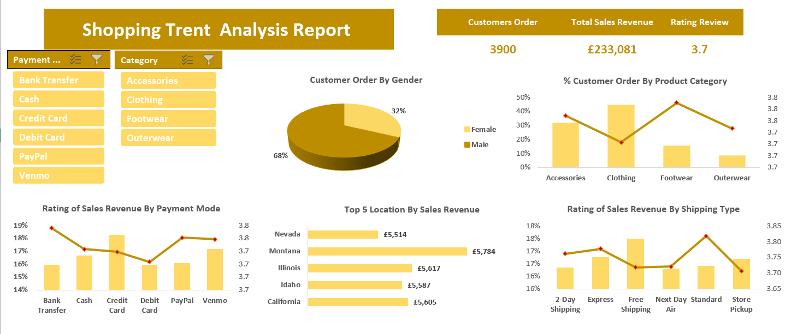

# Project 1 

**Title:** [Vrinda Store Sales  Report - 2022](https://github.com/Aviele75/Aviele75.github.io/blob/main/03%20-%20Data%20Analyst%20Excel%20Project%20-%20Virinda%20Store.xlsx)							
							
**Tools Used:** Microsoft Excel - Data Cleaning, Data Analysis, Charts, Pivot Table, Slicer,Timeline

**Project Description:** 
This project focused on analyzing the product sales data of Vrinda Store for the year 2022, with the primary objective of uncovering sales trends and performance patterns across multiple dimensions. The analysis was developed into an interactive dashboard that offers stakeholders a detailed, user-friendly view of key business metrics, enabling data-driven decision-making and strategic planning. The dashboard includes the following features:

**•	Key Performance Indicators (KPIs):**

o	Total Sales

o	Total Order Quantity

o	Average Order Quantity per Customer

**•	Top 5 States by Sales Revenue:**
A visual breakdown of the five states generating the highest revenue, highlighting state performance and market strengths.

**•	Monthly Sales Revenue:**
A trend visualization displaying monthly revenue fluctuations, allowing stakeholders to identify peak periods and off-seasons.

**•	Sales Revenue by Gender:**
A demographic analysis revealing the revenue contribution based on gender, aiding in customer segmentation strategies.

**•	Sales by Order Categories:**
A breakdown of total sales revenue according to different product order categories, helping assess category-level performance.

**•	Order Quantity by Age Distribution:**
A demographic chart showing order volumes across various age groups, which supports targeted marketing efforts.

**•	Order Delivery Status:**
A comprehensive overview of the delivery outcomes, including orders that were delivered, cancelled, refunded, or returned.

**•	Order Quantity by Distribution Channel:**
Insights into how different distribution channels contribute to order volume, providing guidance for logistics and fulfillment strategies.

Additionally, the dashboard is equipped with interactive features, including dynamic slicers and a time-based filter that allow users to:

•	Filter data by **Month** to analyze performance over a specific period or compare across multiple months.

•	Drill down into specific **Product Categories** to evaluate category-wise performance.

•	Analyze sales based on **Distribution Channels** used for delivering customer orders.

**Key findings:**

**•	High-Performing States:**
The analysis successfully identified the top-performing states in terms of revenue, as well as those with underwhelming performance, highlighting opportunities for targeted market expansion and resource allocation.

**•	Monthly Sales Patterns:**
Clear trends emerged over the course of the year, revealing fluctuations that aligned with product cycles and seasonal demand. These insights can inform inventory planning and promotional strategies.

**•	Top Products and Distribution Channels:**
The dashboard pinpointed the most profitable products and the most effective distribution channels. This is valuable for optimizing marketing efforts and improving supply chain efficiency.

**•	Sales Volatility:**
Observations of monthly sales fluctuations revealed broader market dynamics and consumer behavior trends, helping management anticipate future demand and adjust business strategies accordingly.

**Conclusion:**

This sales performance dashboard stands as a vital tool for the management team at Vrinda Store. By presenting a clear, interactive, and insightful analysis of sales data across multiple dimensions, it enables leadership to make informed decisions, identify growth opportunities, and fine-tune operational strategies. The project not only enhances visibility into business performance but also supports Vrinda Store’s long-term planning and competitive positioning in the market.

**Dashboard Overview:** 

# Project 2

**Title:** Sales Record-SQL Data Manipulation and Interogation

**SQL Code:** [Sales Record SQL Code](https://github.com/Aviele75/Aviele75.github.io/blob/main/Sales_Record.sql)

**SQL Skills Used:** 
Data Retrieval (SELECT): Queried and extracted specific information from the database.
Data Aggregation (SUM, COUNT): Calculated totals, such as sales and quantities, and counted records to analyze data trends.
Data Filtering (WHERE, BETWEEN, IN, AND): Applied filters to select relevant data, including filtering by ranges and lists.
Data Source Specification (FROM): Specified the tables used as data sources for retrieval
 
**Project Description:**
 
**Technology used:** SQL server

# Project 3 

**Title:** [HR Employee Attrition Report 2012-2022](https://github.com/Aviele75/Aviele75.github.io/blob/main/HR%20EMPLOYEE%20ATTRITION.pbix)														

**Tools Used:** PowerBI, Data Transformation and Cleaning using Power Query Editor, Data Modelling, DAX writing, Dashboard Building and Visualization using charts, slicers, scroller, Bookmark and page navigation.

**Project Description:** This project focused on the comprehensive analysis of human resource (HR) data related to employee attrition, spanning a ten-year period from 2012 to 2022. The primary objective was to uncover trends, patterns, and potential factors contributing to staff turnover, with the aim of empowering organizational stakeholders to make informed, data-driven decisions regarding workforce management and retention strategies.

The result of this analysis is an interactive and user-friendly dashboard designed to provide clear visibility into key performance indicators (KPIs) and underlying causes of employee attrition. It incorporates multiple dimensions of the workforce, such as age, overtime hours, job roles, salary, and marital status, offering a holistic view of the HR landscape.

The dashboard incorporates a range of critical metrics and visual representations to facilitate easy data interpretation. Key features include:

**Total Employees:** The overall headcount within the organization.

**Total Salary:** The cumulative salary paid across the workforce.

**Active and Inactive Employees:** Segmentation of currently employed and former staff who have left the organisation.

**Average Salary:** A computed average of all employee salaries to track compensation trends.

**Operational and Demographic Insights:**

**Employee by Department:**  Visual representation of the number of employees within each operational department, aiding in department-level workforce planning.

**Top 5 Highest Paid Employees by Educational Level:**  A breakdown of the highest-earning employees, categorized by their level of educational attainment, useful for correlating compensation with qualifications.

**Active and Inactive Employees by Department:** Illustrates the distribution of current and former employees across different departments to detect departmental attrition patterns.

**Hiring Trend by Year:** Year-over-year visualization of hiring activity, which helps track recruitment efforts and workforce growth.

**Educational Level Distribution:** Highlights the total number of employees segmented by their educational qualifications, supporting diversity and upskilling initiatives.

**Demographic Insights:**  Displays detailed demographic data including: State of residence, Age distribution, Marital status, Gender. This allows for equity-focused HR policies and culturally responsive planning.

**Attrition Report:**  A key component of the dashboard, showcasing employee attrition rates segmented by critical factors such as: Job role, Educational level, Age group, Salary band, Marital status. These insights are essential for identifying high-risk groups and developing targeted retention strategies.

Additionally, the dashboard is equipped with interactive features, including dynamic slicers and a time-based filter that allow users to:

**Year Filter**  Enables users to isolate and analyze data for specific years, allowing focused reviews of performance and attrition trends over time.

**State**  Allows for geographic drill-down to assess how different states contribute to workforce outcomes and to compare regional HR dynamics.

**Key findings:**

**1. High Attrition Rate:**
The analysis identified departments with the highest turnover, offering visibility into areas requiring immediate HR intervention and policy enhancement.

**2. Yearly Workforce Trends:**
The dashboard revealed clear patterns in hiring and attrition across the analyzed period. These trends provide a foundation for anticipating future workforce needs and aligning HR planning accordingly.

**3. Volatile Factors Influencing Attrition:**
Several key variables—age, job roles, overtime compensation, and marital status—were identified as significant contributors to employee turnover. Understanding the volatility of these factors will help organizations to develop tailored retention strategies and adjust policies to better support workforce stability.

**Conclusion:**  

This dashboard report serves as a powerful analytical tool for the HR management team, delivering valuable insights into workforce behavior, organizational structure, and business alignment. It enables proactive decision-making, enhances strategic planning, and supports the implementation of data-driven policies aimed at reducing attrition and optimizing employee engagement.

By offering a clear and comprehensive view of staff dynamics over a decade, the solution not only addresses immediate HR concerns but also positions the organization for long-term success in talent management.

**Dashboard Overview:** 

# Project 4 

**Title:** [Shipping Trend Analysis Report](https://github.com/Aviele75/Aviele75.github.io/blob/main/Shopping%20Trends.xlsx)							
							
**Tools Used:** Microsoft Excel - Pivot Table, Slicer,

**Project Description:** 

**Key findings:**

**Dashboard Overview:** 

# Project 5 

**Title:** [Auto Car Dealer Analysis Report](https://github.com/Aviele75/Aviele75.github.io/blob/main/CAR%20DEALER%20REPORT%20ANALYSIS.pbix)													

**Tools Used:** PowerBI, Data Transformation and Cleaning using Power Query Editor, Data Modelling, DAX writing, Dashboard Building and Visualization using charts, slicers and page navigation.

**Project Description:** 
This project involved the comprehensive analysis of an auto car dealership's sales data, aimed at uncovering key trends, patterns, and performance metrics across various dimensions of the business. The primary objective was to develop an interactive and insightful dashboard that empowers stakeholders to effectively monitor and assess the organization’s operational and financial performance.

The dashboard consolidates and visualizes critical Key Performance Indicators (KPIs), offering a holistic view of business outcomes across different business types, vehicle models, and company locations. Key performance metrics included:

**Total Revenue**

**Total Cost**

**Profit and Loss**

**Total Quantity Sold**

**Purchase Order Amount**

**Dashboard Features**

**Revenue by Company:** Provides a breakdown of total revenue generated by each auto dealership company, enabling comparative analysis of performance across companies and vehicle models.

**Percentage Profit and Loss by Company:**  Visually represents the profit and loss margins for each company, with particular emphasis on identifying which entities experienced the most significant financial losses.

**Purchase Order Amount by Company:** Displays a company-wise distribution of total purchase orders, providing insight into procurement trends and business volume.

**Total Cost Incurred by Company:** Illustrates the total operational costs incurred by each company, supporting a deeper understanding of cost centers and financial efficiency.

**Top 10 Salesmen by Revenue:** Ranks the top 10 sales representatives based on the revenue they generated, allowing management to evaluate individual performance and recognize high achievers.

**Total Cost by Business Type:** Breaks down the operational costs according to business type (e.g., retail, repairs, spare parts), facilitating cost-control strategies at a more granular level.

The dashboard incorporates dynamic slicers to allow stakeholders to:

**Filter by Business Type:** Analyze performance data by specific business operations (e.g., retail, repairs, spare parts).

**Drill Down by Company:** Examine the performance of individual companies within the dealership network.

**Key findings:**

**High Loss Identification:** A significant area of concern was uncovered in the form of high losses, particularly within the repair segment of the business, as opposed to the retail sector. This points to a need for operational reviews and improvement strategies in the repairs unit.

**Revenue and Cost Patterns by Record Type:** The analysis revealed that spare part sales were the largest contributors to revenue. However, they also accounted for a high proportion of total costs, suggesting a need for more strategic cost management in this segment.

**Top-Performing Payment Channel:** Cash emerged as the most profitable payment channel. In contrast, non-cash transactions were associated with the highest loss percentages, warranting a deeper evaluation of these methods and their implications on profitability.

**Sales Volatility and Market Dynamics:** Variability was observed across several factors including car brand, model, location, and service consultant. These fluctuations underscore the importance of understanding consumer behavior and market dynamics to better forecast demand and tailor business strategies.

**Conclusion:**

The sales performance dashboard developed through this project serves as a vital decision-support tool for the management team. By offering a clear, interactive, and data-driven view of business performance, it enhances visibility into operational strengths and weaknesses. This enables the dealership to make informed, strategic decisions that support growth, operational efficiency, and long-term competitive advantage. The insights derived from this dashboard not only facilitate better planning but also position the auto car dealer to proactively adapt to market trends and customer expectations.

**Dashboard Overview:** 

# Project 6 

**Title:** [Cardiology Patient Medical Analysis Report- 2023](https://github.com/Aviele75/Aviele75.github.io/blob/main/Cardiology%20Patient%20Analysis%20Report%202023.xlsx)							
							
**Tools Used:** Microsoft Excel - Pivot Table, Slicer,

**Project Description:** 

**Key findings:**

**Dashboard Overview:** 

# Project 7 

**Title:** [Olympic Game Report Analysis 1896-2016](https://github.com/Aviele75/Aviele75.github.io/blob/main/OLYMPIC%20GAME%20REPORT.pbix)													

**Tools Used:** PowerBI

**Project Description:** 

**Key findings:**

**Dashboard Overview:** 

# Project 8 

**Title:** [Mental Health Analysis Report](https://github.com/Aviele75/Aviele75.github.io/blob/main/Mental%20Health%20Analysis2.pbix)													

**Tools Used:** PowerBI

**Project Description:** 

**Key findings:**

**Dashboard Overview:** 

